# 若依系统开发环境搭建手册


## 1. 准备工作

### 1.1 前置环境准备——安装 Maven

若依基于 Maven 管理项目的构建，需要先安装好相应的版本。

### 1.2 开发工具

若依系统采用 Eclipse 作为开发工具。但不局限于 Eclipse。此处仅介绍在 Eclipse 搭建开发环境所需的操作。

---

## 2. 开发环境搭建

### 2.1 开发工具的配置

#### 2.1.1 配置 Maven

进入 `Window` -> `Preferences` -> `Maven` -> `Installations` 页面，设置已经安装好的 Maven。

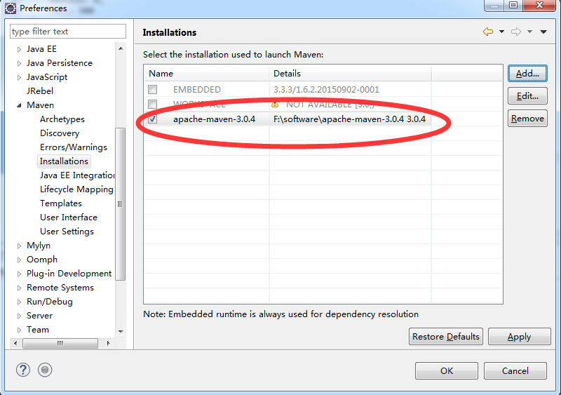

#### 2.1.2 配置 Maven 仓库路径

进入 `Window` -> `Preferences` -> `Maven` -> `User Settings` 页面，配置仓库路径。

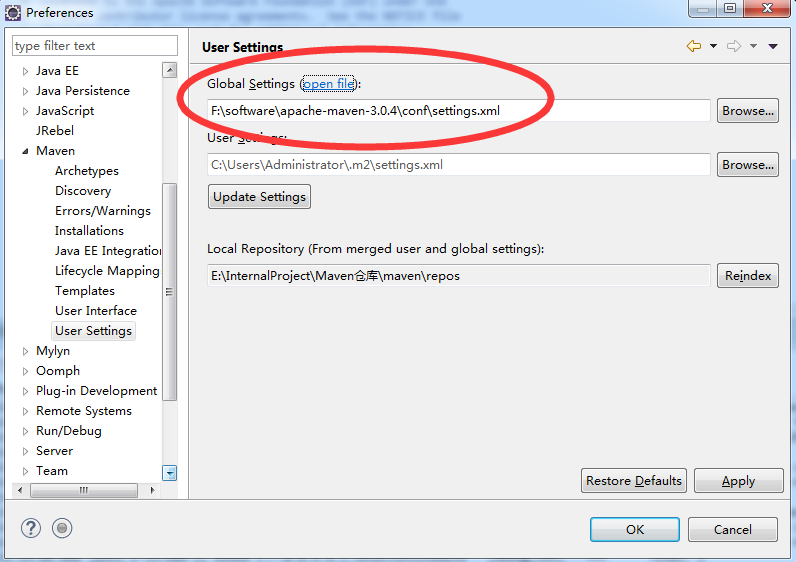

#### 2.1.4 关闭校验

进入 `Window` -> `Preferences` -> `Validation` 页面，勾选 “`Suspend all validators`”，关闭校验

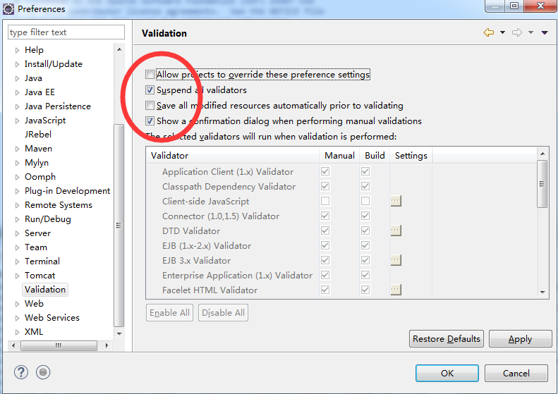

### 2.2 导入工程

通过 Eclipse 导入工程，步骤如下：

1. 点击左侧项目区域 —> `Import...`

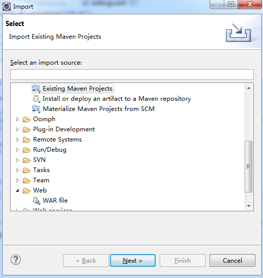

2. 选择 RuoYi

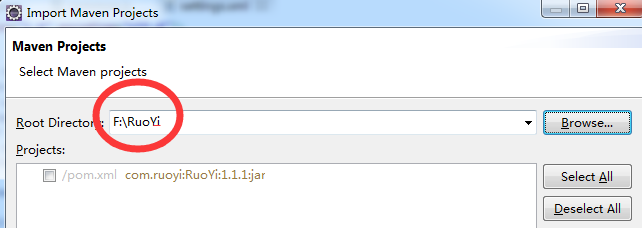

3. 点击 `Finish`

4. RuoYi 的代码就被导出到 Eclipse 中了，此时可以在工程视图中看到：

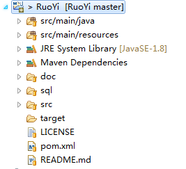

---

## 3. 运行若依系统

### 3.1 必要的配置

#### 3.1.1 修改数据库连接

编辑 `src/main/resources` 目录下的 `application-druid.yml` 文件，修改数据库地址账号信息。

执行 `sql/ ry_20180423.sql`，`quartz.sql` 两个文件，日期随版本变化。

#### 3.1.2 开发环境配置

编辑 `src/main/resources` 目录下的 `application.yml` 文件，

默认端口为 `80`：

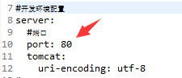


#### 3.1.3 代码生成配置

编辑 `src/main/resources` 目录下的 `application.yml` 文件，

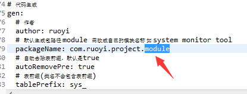

默认为 `module`，根据实际情况修改即可。生成的表要有注释。

注：如对模板有特殊需求，可自行修改。编辑 `src/main/resources/templates/vm` 目录下文件：

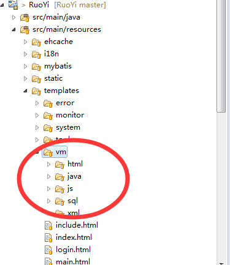

#### 3.1.4 日志配置

编辑 `src/main/resources` 目录下的 `logback.yml` 文件：

`<property name="log.path" value="/home/ruoyi/logs" />`

改为自己需要的路径。

### 3.2 启动及验证（后台）

启动 `RuoYiApplication.java` 出现如下图表示启动成功：


打开浏览器，输入：[http://localhost:8080/captchaImage](http://localhost:8080/captchaImage)

若能正确显示返回信息，搭建后台成功。

### 3.3 启动及验证（前台）

```bash
# 进入项目目录
cd ruoyi-ui

# 安装项目依赖
npm install --registry=https://registry.npm.taobao.org

# 启动
npm run dev
```

打开浏览器，输入：[http://localhost:80](http://localhost:80) （默认账户 `admin` / `admin123`）

若能正确展示登录页面，并能成功登录，菜单及页面展示正常，则表明环境搭建成功。

注意：执行 `npm` 命令需要配置 Node 环境，推荐使用 [nvm](https://github.com/nvm-sh/nvm) 安装管理 Node 环境。

---

## 4. 部署若依系统

### 4.1 `war` 部署方式

#### 4.1.1 修改 `pom.xml` 文件。将 `jar` 修改为 `war`

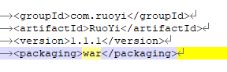

如果是分模块需要修改 `ruoyi-admin`

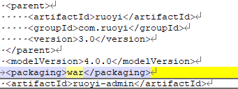

#### 4.1.2 在 `spring-boot-starter` 依赖中移除 tomcat 模块

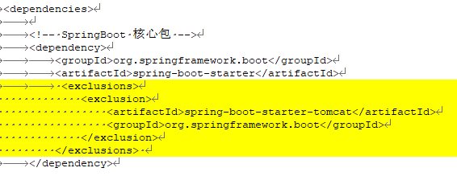

```xml
<exclusions>
  <exclusion>
    <artifactId>spring-boot-starter-tomcat</artifactId>
    <groupId>org.springframework.boot</groupId>
  </exclusion>
</exclusions>
```

#### 4.1.3 部署到 tomcat 的 webapps 目录下面

默认为 `RuoYi.war`

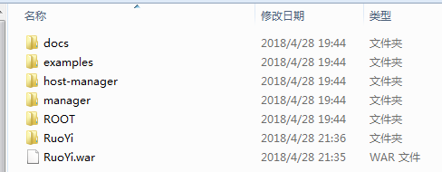

#### 4.1.4 启动及验证

运行 `startup.bat` 出现如下图即部署成功

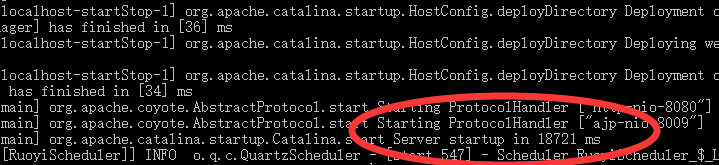

### 4.2 `jar` 方式部署

执行命令：`java –jar RuoYi.jar`

脚本执行：`ry.sh start` 启动，`ry.sh stop` 停止

### 4.3 前端部署

- 打包正式环境：`npm run build:prod`

- 打包预发布环境：`npm run build:stage`

构建打包成功之后，会在根目录生成 `dist` 文件夹，里面就是构建打包好的文件，通常是 `*.js` 、`*.css`、`index.html` 等静态文件。发布到你的 nginx 或者静态服务器即可，其中的 `index.html` 是后台服务的入口页面。

演示地址：[ruoyi.vip](ruoyi.vip)

文档地址：[doc.ruoyi.vip](doc.ruoyi.vip)

---

<以上所有信息均为若依所有>
All Rights reserved, RuoYi 2020
